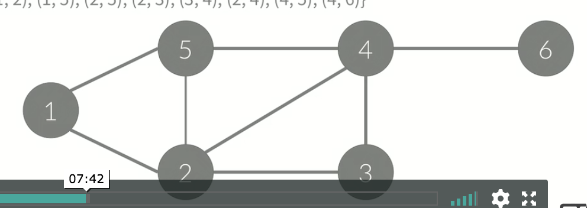
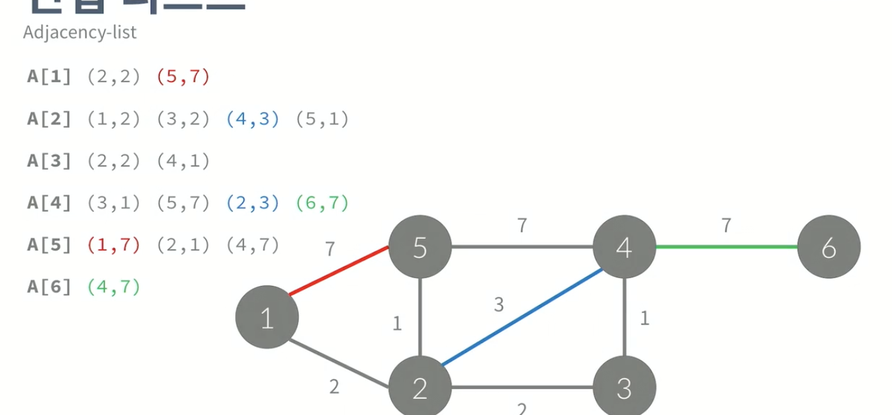
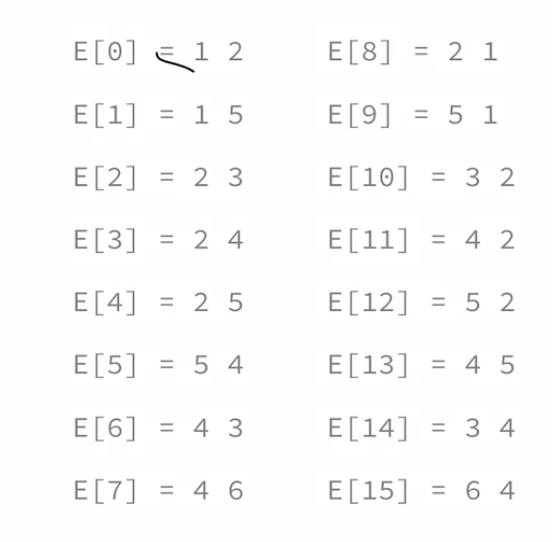

## 그래프

### 그래프

- 자료구조의 일종
- 정점(Node, Vertex)
- 간선(Edge): 정점간의 관계를 나타낸다.
- G = (V, E)로 나타낸다.


### 경로(Path)

- 정점 A에서 B로 가는 경로


### 사이클

- 정점 A에서 다시 A로 돌아오는 경로


### 단순 경로와 단순 사이클(Simple path and Simple Cycle)

- 경로/사이클에서 같은 정점을 두 번 이상을 방문하지 않는 경로 사이클
- 특별한 말이 없으면, 일반적으로 사용하는 경로와 사이클은 단순 경로/사이클


### 방향 있는 그래프

- A->C와 같이 간선에 방향이 있다.


### 방향 없는 그래프

- A-C와 같이 간선에 방향이 없다.
- A-C는 A->C C->A를 나타낸다.
- 양방향 그래프(Bidirectional Graph)라고도 한다.
- 방향 없는 그래프는 나중에 다 방향 있는 그래프로 바꾸어 저장!


### 간선 여러개

- 두 정점 사이에 간선이 여러 개일 수도 있다.
- A->B를 향하는 간선이 여러 개인 경우.


### 루프

- 간선 양 끝 점이 같은 경우


### 가중치

- 간선에 가중치가 있는 경우에는
- A에서 B로 이동하는 거리, 이동하는 데에 필요한 시간, 이동하는 데에 필요한 비용 등등등...


### 차수(Degree)

- 정점과 연결되어 있는 간선의 개수
- 방향 그래프의 경우에는 In-degree와 Out-degree로 나누어서 차수를 계산한다.


### 그래프의 표현

- 아래와 같은 그래프는 정점이 6개, 간선이 8개 있다.
- 간선에 방향이 없기 때문에, 방향이 없는 그래프이다.
- 정점: {1, 2, 3, 4, 5, 6}
- 간선: {(1, 2), (1, 5), (2, 5), (2, 3), (2, 4), (3, 4), (4, 5), (4, 6)}




### 그래프 저장 방법

- 인접 행렬
- 인접 리스트
- 한 정점 x와 연결된 간선을 효율적으로 찾는 구조를 만들기 위해 그래프 저장 방법 2 가지를 배움.


### 인접 행렬(Adjacency Matrix)

- 정점의 개수를 V라고 했을 때
- VxV 크기의 이차원 배열을 이용한다.
- `A[i][j]=1`(i->j 간선이 있을 때), `A[i][j]=0` (없을 때)
- `A[i][j]=w`(i->j 간선이 있을 때, 그 가중치 w), `A[i][j]=0` (없을 때)

- 정점 V개, 간선 E일 때, 
  - 공간:  V^2
  - 한 정점에 연결된 모든 간선을 찾는 시간 복잡도: O(V)


### 인접 리스트(Adjacency List)

- 리스트를 이용해서 구현한다
  - 간선이 몇 개가 있을 지 알 수 없는 경우에 사용.
  - 동적으로 하나씩 증가시켜 사용
- A[i]=i와 연결된 정점을 리스트로 포함하고 있음. 
- 가중치가 있을 경우, 해당 정점 번호와 가중치를 묶어서 저장해줌.



- 리스트는 크기를 동적으로 변경할 수 있어야 한다.
- 링크드 리스트나 길이를 동적으로 변경할 수 있는 배열(vector)을 사용한다
  - 링크드 리스트 없이 C++의 vector을 사용하면 됨!
- 공간 복잡도:
  - 인접 행렬: O(V^2)
  - 인접 리스트: O(E) -> 없는 간선은 저장하지 않기 때문
- 시간 복잡도: 
  - 인접 리스트-__한 정점과 연결된 모든 간선을 찾는 시간__: O(차수)
- 공간적, 시간적으로 인접 리스트가 유리하기에, 우리는 __인접 리스트__ 를 사용해서 구현할 것!
- 임의의 두 정점 사이에 간선이 있는지/없는지 구할 때, 시간적으로 __인접 행렬__이 더 유리함.

### 간선 리스트(Edge List)

- 배열을 이용해서 구현한다.
- 간선을 모두 저장하고 있다.
- E라는 배열에 간선을 모두 저장한 후, 앞 정점을 기준으로 정렬하여 cnt라는 배열에 넣어줌



| i      | 0    | 1    | 2    | 3    | 4    | 5    | 6    |
| ------ | ---- | ---- | ---- | ---- | ---- | ---- | ---- |
| cnt[i] | 0    | 2    | 6    | 8    | 12   | 15   | 16   |

- 1번은 0부터 2 전 까지, 2번은 2부터 6 전까지, ...
- 시간복잡도: O(차수) + 정렬
- 인접리스트는 써야하는데, 라이브러리의 사용이 금지되어 있어서, 링크드리스트를 구현하자니 머리가 아플 때 사용하는 것!


### 그래프의 탐색

- DFS: 깊이 우선 탐색 --> stack
- BFS: 너비 우선 탐색 --> queue
- 목적: 임의의 정점에서 시작해서 연결되어 있는 모든 정점을 1번씩 방문하는 것.
- 차이: 어떤 순서로 정점을 방문할 것이냐=


### 깊이 우선 탐색

- 스택을 이용해서 갈 수 있는 만큼 최대한 많이 가고
- 갈 수 없으면 이전 정점으로 돌아간다.
- 정점을 방문했는지 체크하는 check 배열 생성(1이면 방문, 0이면 미방문), 스택을 사용
- 재귀 호출을 이용해서 구현할 수 있다.

```c++
//x를 방문
//시간복잡도 O(v^2)
void dfs(int x){
  check[x]=true;
  //n=v
  for(int i=1; i<=n; i++){
    if(a[x][i]==1&&check[i]==false){
      dfs(i);
    }
  }
}
```

- 인접리스트를 이용해서도 구현할 수 있다.

```c++
//시간 복잡도O(V+E)
//대부분 v<=e이기 때문에, O(E)
void dfs(int x){
  check[x]=true;
  for(int i=0; i<a[x].size(); i++){
    int y=a[x][i];
    if(check[y]==false){
      dfs(y);
    }
  }
}
```


### 너비 우선 탐색

- 큐를 이용해서 지금 위치에 갈 수 있는 것을 모두 큐에 넣는 방식
- 큐에 __넣을 때__( 뺄 때가 아니라 넣을 때!!) 방문했다고 체크해야 한다.

- 인접 행렬을 사용하여 구현할 수 있다.
- 1260 문제 풀어보기!

```c++
queue<int> q;
check[1] = true;
q.push(1);
while(!q.empty()){
  int x = q.front();
  q.pop();
  for(int i=1; i<=n; i++){
    if(a[x][i]==1&&check[i]==false){
      check[i]=true;
      q.push(i);
    }
  }
}
```

