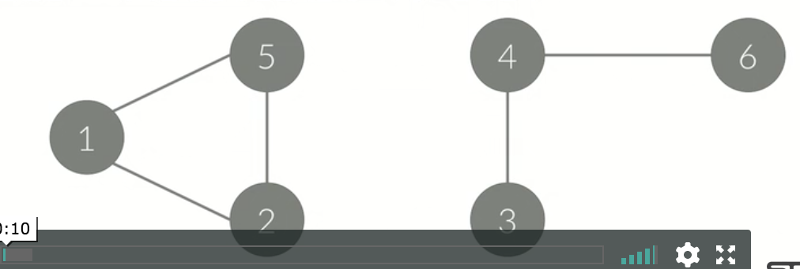
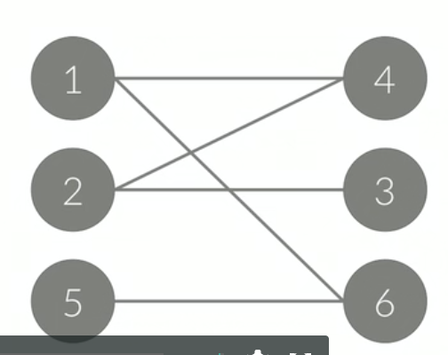

## 연결 요소(Connected Component)

- 그래프가 아래 그림과 같이 나누어져 있지 않은 경우가 있을 수도 있다.
  - 아래 그래프는 그래프가 하나일 수도, 두 개일 수도 있다.
  - 아래 그래프를 하나라고 했을 때, 연결 요소가 2개가 있는 그래프라 볼 수 있다.
  - 연결 요소가 2개 이상이면, 그래프가 끊어져있는 것.
- 이렇게 나누어진 각각의 그래프를 연결 요소라고 한다.
- 연결 요소에 속한 모든 정점들을 연결하는 경로가 있어야 한다.
- 또, 다른 연결 요소에 속한 정점과 연결하는 경로가 있으면 안된다.

## 이분 그래프(Bipartite Graph)

- 그래프를 다음과 같이 A와 B로 나눌 수 있으면, 이분 그래프라고 한다.
- A에 포함되어 있는 정점끼리 연결된 간선이 없음.
- B에 포함되어 있는 정점끼리 연결된 간선이 없음.
-  모든 간선의 한 끝 점은 A에, 다른 끝 점은 B에 있음.

